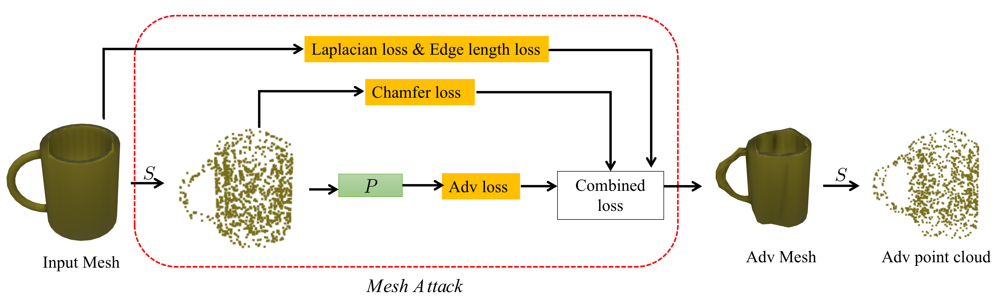
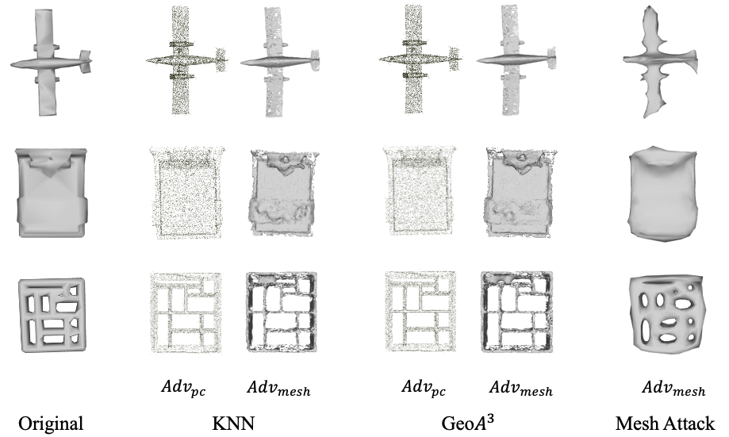
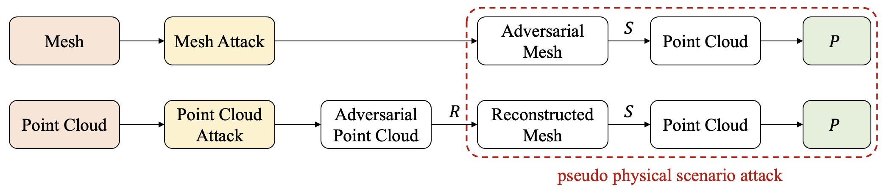
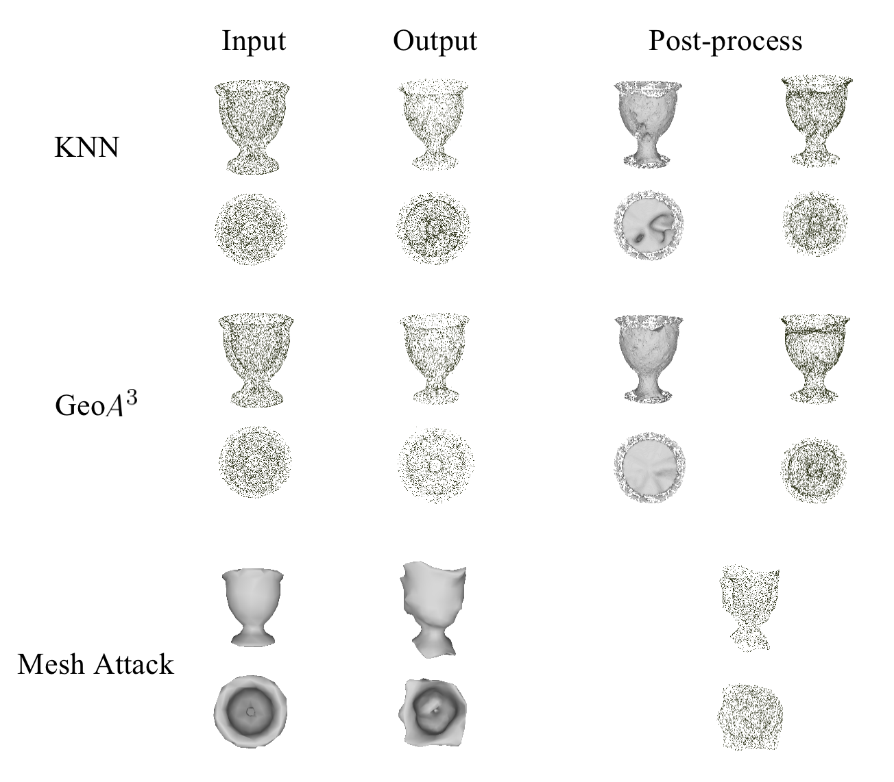
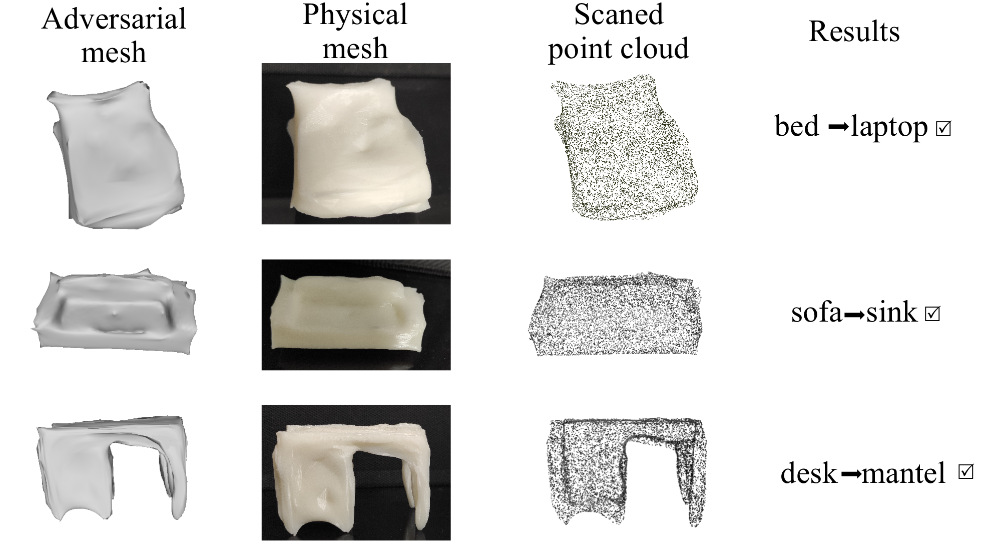

# Mesh-Attack
[3D Adversarial Attacks Beyond Point Cloud ](https://arxiv.org/abs/2104.12146.pdf)

## Introduction

We propose a strong 3D adversarial attack for both the physical scenario and the pseudo physical scenario, named Mesh Attack, you can also check out [paper](https://arxiv.org/pdf/2104.12146.pdf) for more information.



Recently, 3D deep learning models have been shown to be susceptible to adversarial attacks like their 2D counterparts. Most of the state-of-the-art (SOTA) 3D adversarial attacks perform perturbation to 3D point clouds. To reproduce these attacks in the physical scenario, a generated adversarial 3D point cloud need to be reconstructed to mesh, which leads to a significant drop in its adversarial effect. In this paper, we propose a strong 3D adversarial attack named Mesh Attack to address this problem by directly performing perturbation on mesh of a 3D object. In order to take advantage of the most effective gradient-based attack, a differentiable sample module that back-propagate the gradient of point cloud to mesh is introduced. To further ensure the adversarial mesh examples without outlier and 3D printable, three mesh losses are adopted. Extensive experiments demonstrate that the proposed scheme outperforms SOTA 3D attacks by a significant margin. We also achieved SOTA performance under various defenses. 

* Adversarial examples crafted by the KNN attack, the $GeoA^3$ attack and our proposed Mesh Attack on the Pointnet. The $Adv_{pc}$ and $Adv_{mesh}$ denote the adversarial point cloud and the adversarial mesh, respectively. The $Adv_{mesh}$ of KNN attack and $GeoA^3$ attack were reconstructed from the $Adv_{pc}$. The adversarial perturbation
was small in the point cloud space, but lead to very substantial “noise” in the reconstructed mesh. Our Mesh Attack is able to avoid those "noise".

### Comparison with SOTA
* Comparison between our Mesh Attack (top row) and previous point cloud attacks (bottom row) in pseudo physical scenarios.

* Qualitative results on "vase" instance. We provide the visual results from two perspectives, front view (top row) and top view (bottom row). For the KNN attack and $GeoA^3$ attack, the perturbation was small in the output adversarial point cloud, but lead to huge "noise" in the reconstructed mesh, and further affected the final adversarial point cloud in pseudo physical scenario. While for our Mesh Attack, the final adversarial point cloud can be directly sampled from the output adversarial mesh without quality drop.


### Physical attack
* Visualization of the physical attack. Following Geoa3, the adversarial meshes are randomly selected from Table 1 in our [paper](https://arxiv.org/pdf/2104.12146.pdf). After 3D printing and scanning, the scanned points was used to attack Pointnet. A black tick indicates a successful attack.


### Setup
```
#python env
pip install -r requirements.txt

#Mesh data
Manfold40 can be downloaded via this link(https://cloud.tsinghua.edu.cn/f/2a292c598af94265a0b8/?dl=1).

```

### Run Mesh Attack
```
CUDA_VISIBLE_DEVICES=0 python -m torch.distributed.launch --nproc_per_node=1 --master_port=29508 mesh_attack.py --model pointnet
```

### Acknowledgment
* [SubdivNet](https://github.com/lzhengning/SubdivNet)
* [IF-Defense](https://github.com/Wuziyi616/IF-Defense)
* [PointCutMix](https://github.com/cuge1995/PointCutMix)

### Citation

if you find our work useful in your research, please consider citing:

```
@article{zhang20213d,
  title={3d adversarial attacks beyond point cloud},
  author={Zhang, Jinlai and Chen, Lyujie and Liu, Binbin and Ouyang, Bo and Xie, Qizhi and Zhu, Jihong and Li, Weiming and Meng, Yanmei},
  journal={arXiv preprint arXiv:2104.12146},
  year={2021}
}
```


